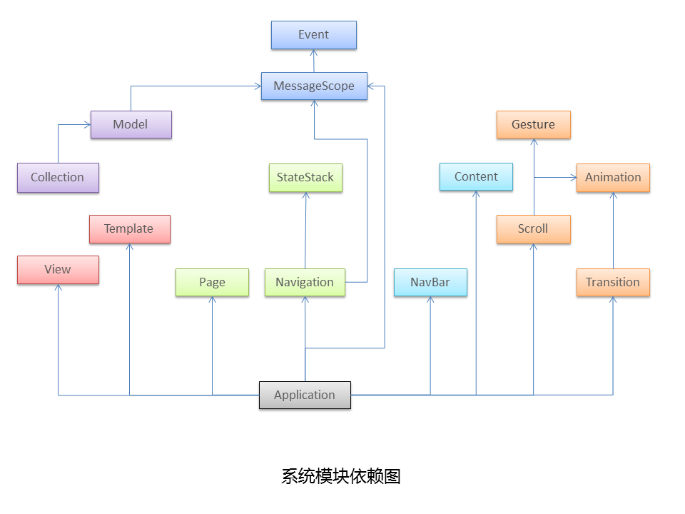

# API手册

##app

### start(config)

* @param {object} [config]

启动App。config的字段同`app.config`

### setTemplate(id, tpl)

* @param {string} id
* @param {string|function} tpl

设置模板

### extendView(properties)

* @param {object} properties
* @return {Class} a child class of View

扩展视图

### getView(name)

* @param {string} name
* @return {View} an instance of View

获得名为name的视图实例

### definePage(properties)

* @param {object} properties
* @return {Page} an instance of Page

定义页面

### definePageMeta(properties)

* @param {object} properties

定义页面元数据

### getPage(name)

* @param {string} name
* @return {Page} an instance of Page

获得名为name的页面实例

### loadResource(urls, callback)

* @param {string|array} urls
* @param {function} callback

依次加载urls中的资源（JS/CSS）文件，完成后调用callback。

##app.config

### viewport

* @var {HTMLElement}

设置视觉区域结点，默认为class是`viewport`的HTMLElement或者`document.body`。

### enableMessageLog

* @var {boolean}
 
设置在控制台输出消息日子，默认为`false`

### enableContent

* @var {boolean|object}

设置页面内容区域结点，默认为class是`content`的HTMLElement或者和视觉区域结点相同。

当为object时，可以有以下字段：

	wrapEl: 视觉区域结点
	cacheLength: 缓存页面内容的长度，默认为5

### enableNavbar

* @var {boolean|object}

设置是否启用导航栏，默认为`false`。

当为object时，可以有以下字段：

	wrapEl: 导航栏结点，默认为class是`navbar`的HTMLElement。
	titleEl: 导航栏中的标题结点。
	backWrapEl: 导航栏中返回按钮的父结点
	funcWrapEl: 导航栏中功能按钮的父结点

### enableToolbar

* @var {boolean|object}

设置是否启用工具栏，默认为false。

当为object时，可以有以下字段：

	wrapEl: 工具栏结点，默认为class是`toolbar`的HTMLElement。

### enableScroll

* @var {boolean}

设置是否启用页内滚动，默认为false

### enableTransition

* @var {boolean}

设置是否启用转场效果，默认为false

### templateEngine

* @var {object}

定义模版引擎的load、compile和render方法。

##app.navigation

### push(fragment, options)

* @param {string} fragment
* @param {object} [options]

（导航）前进操作。fragment指定路径，`options`可指定以下参数：

	transition: 转场动画，backward/forward
	type: 传递参数的类型，GET/POST
	data: 参数键值对

### pop()

（导航）后退操作。

### resolveFragment(name, params)

* @param {string} name
* @param {object} params
* @return {string} a hash fragment

返回处理后的Hash片段。例如有个名为`index`的路由，其正则表达式为`index/(P<name>\w+)`，那么resolveFragment('index', {name:'test'})的返回值为`index/test`。

### getReferer()

* @return {string} a referer

获得上一个页面的地址。

### getParameter(name)

* @param {string} name
* @return {string} a value

获取路由中名为name的参数值以及通过GET/POST传递过来的名为name的参数值。

### getParemters()

* @return {object} a set of values

获取所有参数键值对。

### setData(name, value)

* @param {string} name
* @param {*} value

设置GET/POST的参数值。

### setTitle(title)

* @param {string} title

设置标题的内容。支持HTML片段。

### setButton(options)

* @param {object} options

设置导航栏的按钮，options的参数如下：

	id: 按钮的id
	class: 按钮的class
	text: 按钮的文本
	bg: 按钮的背景样式（style.background）
	icon: 按钮的图标（button中设置img标签）
	hide: 是否隐藏
	handler: 按钮点击的句柄

### setToolbar(options)

* @param {object} options

设置工具栏，options的参数如下：

	html: 插入到工具栏的HTML片段
	el: 插入到工具栏中的DOM结点
	height: 工具栏的高度

##app.scroll

### getScrollHeight()

* @return {Number} height

获取滚动区域的高度

### getScrollTop()

* @return {Number} height

获取滚动区域的当前位置

### refresh()

刷新滚动区域

### offset(el)

* @param {HTMLElement} element
* @return {object} a rectangle object

返回滚动区域内某元素的矩阵数据，包括top/bottom/width/height/left/right

### scrollTo(y)

* @param {Number} y value

滚动到某位置

### scrollToElement(el)

* @param {HTMLElement} element

滚动到某元素

### getBoundaryOffset()

* @return {object} a offset object

获取滚动区域回弹时的偏移值

### getViewHeight()

* @return {Number} height

获得滚动区域的可见区域高度

### stopBounce()

出现回弹时，停止回弹

### resumeBounce()

恢复回弹

### addEventListener(name, handler, isBubble)

* @param {string} a event name
* @param {function} a event handler
* @param {boolean} if bubble

绑定事件，事件包括：

	scrollstart: 滚动开始
	scrollend: 滚动结束
	pulldown: 上边界下拉
	pullup: 下边界上拉
	bouncestart: 边界回弹开始
	bounceend: 边界回弹结束

### removeEventListener(name, handler)

* @param {string} a event name
* @param {function} a event handler

解绑事件。

## app.module.Animation

## app.module.Collection

## app.module.Content

## app.module.EventSource

## app.module.MessageScope

## app.module.Model

## app.module.Navbar

## app.module.Navigation

## app.module.Page

## app.module.Scroll

## app.module.StateStack

## app.module.Template

## app.module.Toolbar

## app.module.Transition

## app.module.View

## 模块依赖关系图

	

